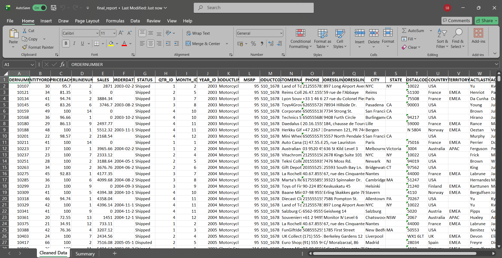
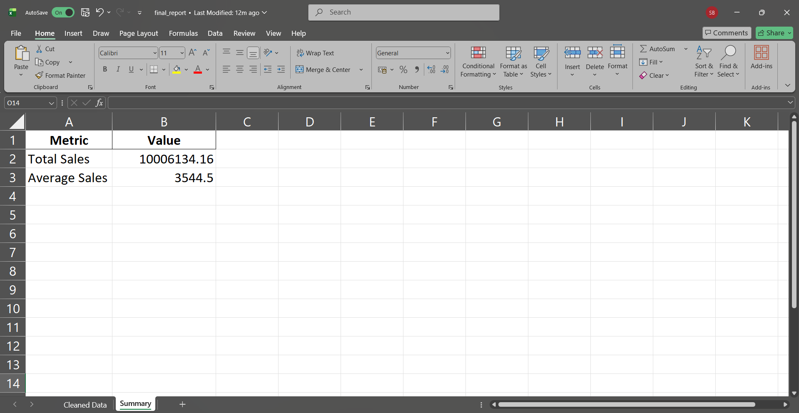

# CSV to Excel Automation & Sales Report Generator

Python automation script to clean messy sales data from CSV files and generate a structured Excel report automatically.

## Features
- Handles CSV encoding issues
- Cleans text and numeric data
- Fixes date formatting
- Generates business summary (total & average sales)
- Outputs a clean Excel report with multiple sheets

## Tech Stack
- Python
- Pandas
- OpenPyXL

## How to Run
```bash
pip install pandas openpyxl
python csv_to_excel_automation.py

```

Public sample data was used for demonstration purposes.


## Project Preview

**Raw CSV (Before Cleaning)**  


**Cleaned Excel Output**  


**Summary Metrics**  


